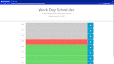

# Work-Day-Scheduler
## Description
An application that helps the user plan out a normal work day

## Features
The current date is dispalyed at the top of the page

The current hour will be highlighted in red

Past hours will be highlighted in grey

Future hours will be highlighted in green

A save button that will save the text content into local storage

## Usage
* Open Link Url
* Click on time block of your choice
* Enter the event or task that you have to do
* Click the save button to the right
* You can safely refresh or come back to the page after

## Links

* [Deployed Application URL](https://victorlmorales.github.io/Work-Day-Scheduler/)

## Application Demo

## License

This project is covered under the MIT License. (Refer to the LICENSE file)